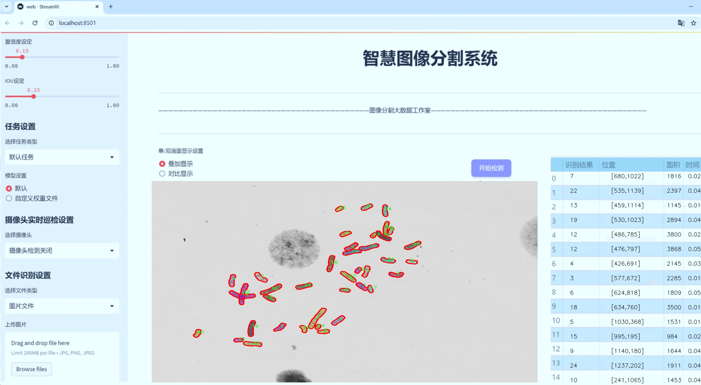
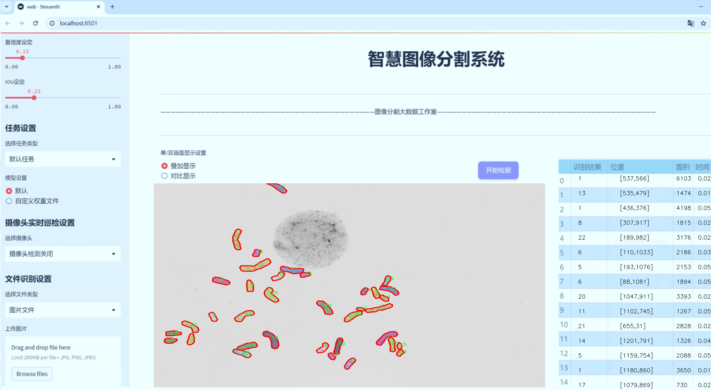
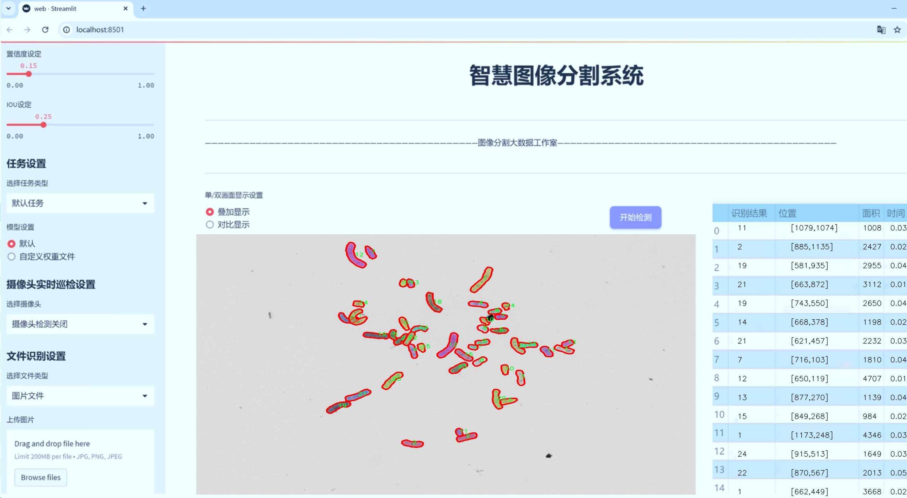
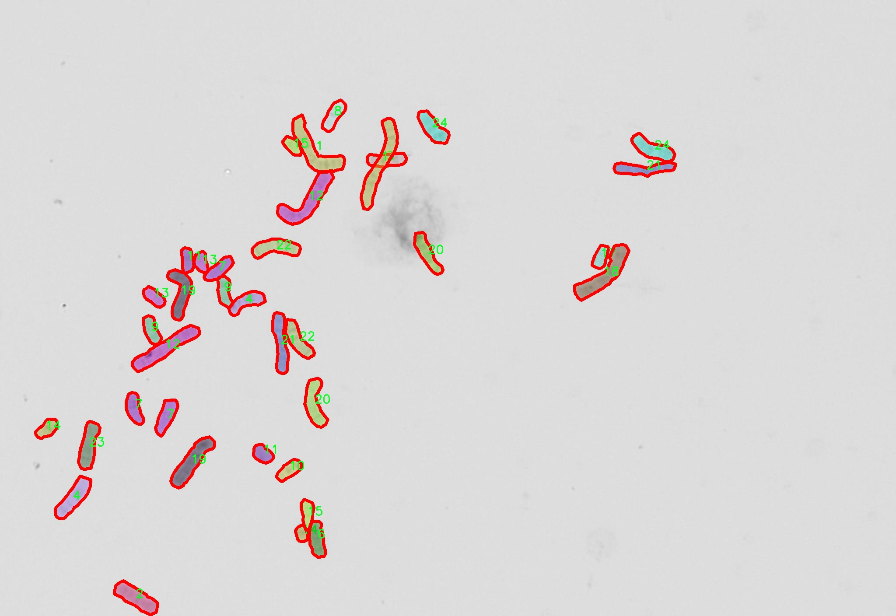
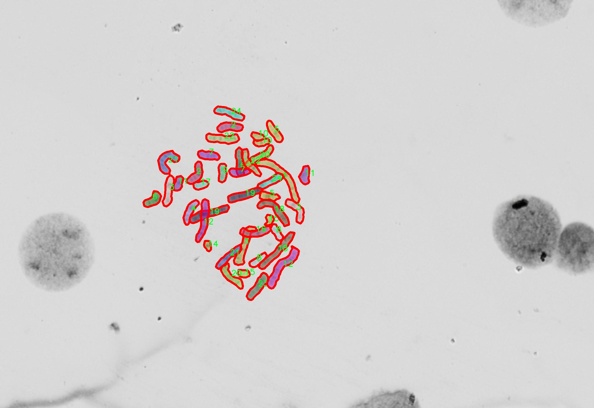
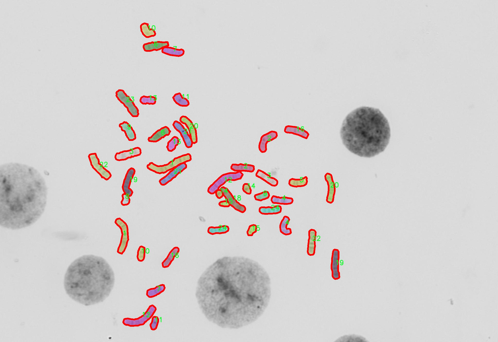
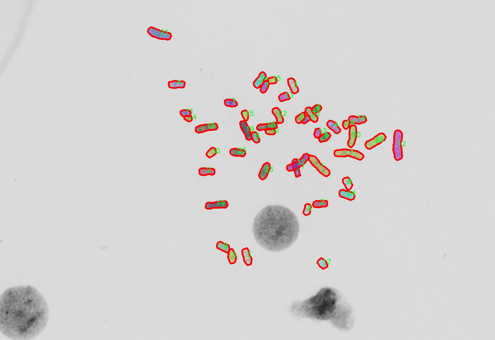

# 染色体图像分割系统： yolov8-seg-KernelWarehouse

### 1.研究背景与意义

[参考博客](https://gitee.com/YOLOv8_YOLOv11_Segmentation_Studio/projects)

[博客来源](https://kdocs.cn/l/cszuIiCKVNis)

研究背景与意义

随着生物医学领域的快速发展，染色体图像的分析与处理已成为细胞遗传学研究中的重要任务。染色体的形态特征不仅与细胞的遗传信息密切相关，还在疾病的诊断、治疗和预后评估中发挥着关键作用。传统的染色体图像分析方法往往依赖于人工观察和手动标注，这不仅耗时耗力，而且容易受到主观因素的影响，导致结果的不一致性和可靠性不足。因此，开发一种高效、准确的染色体图像分割系统显得尤为重要。

近年来，深度学习技术的迅猛发展为图像处理领域带来了革命性的变化。特别是目标检测和实例分割任务中，YOLO（You Only Look Once）系列模型因其优越的实时性和准确性而受到广泛关注。YOLOv8作为该系列的最新版本，进一步提升了模型的性能，能够在保持高精度的同时实现快速推理。然而，尽管YOLOv8在一般目标检测任务中表现出色，但在染色体图像的实例分割任务中，仍然面临着一些挑战，例如背景复杂性、染色体重叠以及不同类别染色体形态的多样性等。

本研究旨在基于改进的YOLOv8模型，构建一个高效的染色体图像分割系统。我们将利用“autokary4”数据集，该数据集包含1300幅染色体图像，涵盖24个类别的染色体实例。这一丰富的数据集为模型的训练和评估提供了坚实的基础。通过对数据集的深入分析，我们可以识别出不同类别染色体的特征，进而优化模型的结构和参数设置，以提高分割精度和鲁棒性。

在研究意义方面，首先，基于改进YOLOv8的染色体图像分割系统将为细胞遗传学研究提供一种自动化的分析工具，极大地提高了染色体分析的效率和准确性。其次，该系统的成功应用将为临床诊断提供重要的技术支持，尤其是在遗传疾病的筛查和癌症的早期检测中，能够帮助医生更快速、准确地识别异常染色体，进而制定相应的治疗方案。此外，本研究还将推动深度学习技术在生物医学领域的应用，探索其在其他生物图像分析任务中的潜力。

综上所述，基于改进YOLOv8的染色体图像分割系统的研究不仅具有重要的理论价值，还有助于推动生物医学图像处理技术的发展。通过本研究，我们希望能够为染色体图像分析提供新的思路和方法，促进相关领域的进步，为人类健康事业做出贡献。

### 2.图片演示







注意：本项目提供完整的训练源码数据集和训练教程,由于此博客编辑较早,暂不提供权重文件（best.pt）,需要按照6.训练教程进行训练后实现上图效果。

### 3.视频演示

[3.1 视频演示](https://www.bilibili.com/video/BV1m8USYjEBn/)

### 4.数据集信息

##### 4.1 数据集类别数＆类别名

nc: 24
names: ['1', '10', '11', '12', '13', '14', '15', '16', '17', '18', '19', '2', '20', '21', '22', '23', '24', '3', '4', '5', '6', '7', '8', '9']


##### 4.2 数据集信息简介

数据集信息展示

在本研究中，我们采用了名为“autokary4”的数据集，以训练和改进YOLOv8-seg的染色体图像分割系统。该数据集的设计旨在为染色体图像分析提供丰富的样本，助力于生物医学领域的研究与应用。通过精确的图像分割，研究人员能够更好地识别和分析染色体的结构与功能，从而为遗传学、细胞生物学等领域的深入研究提供重要的数据支持。

“autokary4”数据集包含24个类别，涵盖了不同类型的染色体图像。这些类别的命名采用了数字形式，从“1”到“24”，分别对应不同的染色体特征或类型。具体而言，这些类别可能代表了不同的染色体形态、大小、结构特征或染色体的特定状态。这种细致的分类使得数据集在图像分割任务中具有高度的针对性和实用性，为YOLOv8-seg模型的训练提供了多样化的样本。

在数据集的构建过程中，研究团队确保了样本的多样性和代表性。每个类别的图像均经过精心挑选，涵盖了不同的染色体图像拍摄条件和背景，以增强模型的泛化能力。数据集中的图像不仅包括了清晰的染色体图像，还包含了在不同光照、对比度和分辨率下拍摄的样本。这种多样性有助于提高YOLOv8-seg在实际应用中的鲁棒性，使其能够在不同的实验条件下保持高效的分割性能。

为了进一步提升模型的训练效果，数据集还进行了数据增强处理。通过对原始图像进行旋转、缩放、翻转和颜色调整等操作，研究团队生成了大量的变体图像。这些增强后的图像不仅增加了数据集的规模，还丰富了模型的训练样本，使其能够更好地适应各种复杂的图像特征。这种数据增强策略在深度学习模型的训练中被广泛应用，能够有效减少过拟合现象，提高模型的泛化能力。

在数据集的标注过程中，采用了精确的标注工具，确保每个染色体图像中的目标区域被准确标识。标注工作由经验丰富的生物医学专家完成，他们对染色体的形态和特征有着深入的理解。这种专业的标注不仅提高了数据集的质量，也为后续的模型训练和评估提供了可靠的基础。

总之，“autokary4”数据集为改进YOLOv8-seg的染色体图像分割系统提供了坚实的数据基础。通过丰富的类别设置、多样化的样本和精确的标注，该数据集不仅满足了研究需求，也为染色体图像分析的深入研究提供了广阔的前景。随着深度学习技术的不断发展，基于该数据集的研究将有望推动染色体图像分析的进步，为生物医学领域的科学探索提供新的动力。










### 5.项目依赖环境部署教程（零基础手把手教学）

[5.1 环境部署教程链接（零基础手把手教学）](https://www.bilibili.com/video/BV1jG4Ve4E9t/?vd_source=bc9aec86d164b67a7004b996143742dc)


[5.2 安装Python虚拟环境创建和依赖库安装视频教程链接（零基础手把手教学）](https://www.bilibili.com/video/BV1nA4VeYEze/?vd_source=bc9aec86d164b67a7004b996143742dc)

### 6.手把手YOLOV8-seg训练视频教程（零基础手把手教学）

[6.1 手把手YOLOV8-seg训练视频教程（零基础小白有手就能学会）](https://www.bilibili.com/video/BV1cA4VeYETe/?vd_source=bc9aec86d164b67a7004b996143742dc)


按照上面的训练视频教程链接加载项目提供的数据集，运行train.py即可开始训练



     Epoch   gpu_mem       box       obj       cls    labels  img_size
     1/200     0G   0.01576   0.01955  0.007536        22      1280: 100%|██████████| 849/849 [14:42<00:00,  1.04s/it]
               Class     Images     Labels          P          R     mAP@.5 mAP@.5:.95: 100%|██████████| 213/213 [01:14<00:00,  2.87it/s]
                 all       3395      17314      0.994      0.957      0.0957      0.0843

     Epoch   gpu_mem       box       obj       cls    labels  img_size
     2/200     0G   0.01578   0.01923  0.007006        22      1280: 100%|██████████| 849/849 [14:44<00:00,  1.04s/it]
               Class     Images     Labels          P          R     mAP@.5 mAP@.5:.95: 100%|██████████| 213/213 [01:12<00:00,  2.95it/s]
                 all       3395      17314      0.996      0.956      0.0957      0.0845

     Epoch   gpu_mem       box       obj       cls    labels  img_size
     3/200     0G   0.01561    0.0191  0.006895        27      1280: 100%|██████████| 849/849 [10:56<00:00,  1.29it/s]
               Class     Images     Labels          P          R     mAP@.5 mAP@.5:.95: 100%|███████   | 187/213 [00:52<00:00,  4.04it/s]
                 all       3395      17314      0.996      0.957      0.0957      0.0845


### 7.50+种全套YOLOV8-seg创新点加载调参实验视频教程（一键加载写好的改进模型的配置文件）

[7.1 50+种全套YOLOV8-seg创新点加载调参实验视频教程（一键加载写好的改进模型的配置文件）](https://www.bilibili.com/video/BV1Hw4VePEXv/?vd_source=bc9aec86d164b67a7004b996143742dc)

### YOLOV8-seg算法简介

原始YOLOv8-seg算法原理

YOLOv8-seg算法是Ultralytics团队在YOLO系列模型的基础上，结合了近年来深度学习领域的多项创新与改进，于2023年1月推出的一个重要版本。作为YOLO系列的最新迭代，YOLOv8-seg不仅在目标检测方面展现出卓越的性能，同时也引入了图像分割的能力，使其在处理复杂场景时更具灵活性和准确性。该算法的设计理念是通过高效的特征提取和融合机制，实现对目标的精确定位与分割，从而满足实时性和准确性并重的应用需求。

在YOLOv8-seg的网络结构中，整体架构依然遵循YOLO系列一贯的设计思路，分为主干网络（Backbone）、颈部网络（Neck）和头部网络（Head）三个主要部分。主干网络负责从输入图像中提取多层次的特征，YOLOv8-seg在此基础上进行了重要的改进，采用了C2f模块替代了传统的C3模块。C2f模块的设计灵感来源于YOLOv7中的ELAN结构，通过引入更多的跳层连接，显著增强了梯度流的丰富性，进而提升了模型的学习能力与表现。此外，YOLOv8-seg保留了SPPF（Spatial Pyramid Pooling Fast）模块，这一设计不仅保持了特征提取的效果，同时有效减少了计算时间，提升了整体推理速度。

在颈部网络中，YOLOv8-seg同样对C3模块进行了替换，采用C2f模块来实现特征的融合与处理。这一变化使得模型在特征整合的过程中，能够更好地捕捉到不同尺度下的目标信息，增强了对复杂场景的适应能力。值得注意的是，YOLOv8-seg在颈部网络中还删除了两处上采样之前的卷积连接层，这一简化设计进一步提升了网络的运行效率，减少了不必要的计算开销。

头部网络是YOLOv8-seg的核心部分，采用了YOLOX中引入的解耦头结构。这一结构将分类和定位任务分为两个并行的分支，分别专注于提取类别特征和位置特征。由于分类任务更关注特征图中各类别之间的相似性，而定位任务则侧重于边界框与真实框之间的关系，这种解耦设计有效提升了模型的收敛速度和预测精度。此外，YOLOv8-seg还引入了无锚框结构，直接预测目标的中心位置，并通过任务对齐学习（Task Alignment Learning, TAL）来优化正负样本的区分。这一创新使得模型在处理复杂背景和多目标场景时，能够更好地平衡分类和定位的性能。

在数据增强方面，YOLOv8-seg对Mosaic数据增强策略进行了调整，特别是在训练的最后10个epoch中停止使用这一策略。这一决定是基于对模型鲁棒性和泛化能力的深刻理解，旨在避免在数据增强过程中引入不必要的噪声，从而保持数据的真实分布，确保模型能够学习到更有效的信息。

YOLOv8-seg在性能上取得了显著的进展。在COCO数据集上的实验结果显示，YOLOv8-seg在相同模型尺寸下的检测精度（mAP）相比于其他YOLO系列模型有了明显提升，同时在推理速度上也表现出色。这一切都表明，YOLOv8-seg不仅在理论上进行了深入的创新，在实际应用中也展现出了强大的竞争力。尤其是在实时性要求较高的应用场景中，如智能监控、自动驾驶和机器人视觉等，YOLOv8-seg的高效性和准确性使其成为了理想的选择。

综上所述，YOLOv8-seg算法的原理和设计理念体现了深度学习领域的最新进展与实践经验。通过对网络结构的精心设计和对数据处理策略的合理调整，YOLOv8-seg在目标检测与图像分割任务中展现出了优越的性能，具有广泛的应用前景和研究价值。随着对YOLOv8-seg的深入研究和探索，未来在更多复杂场景中的应用将会进一步拓展其能力与潜力。


### 9.系统功能展示（检测对象为举例，实际内容以本项目数据集为准）

图9.1.系统支持检测结果表格显示

  图9.2.系统支持置信度和IOU阈值手动调节

  图9.3.系统支持自定义加载权重文件best.pt(需要你通过步骤5中训练获得)

  图9.4.系统支持摄像头实时识别

  图9.5.系统支持图片识别

  图9.6.系统支持视频识别

  图9.7.系统支持识别结果文件自动保存

  图9.8.系统支持Excel导出检测结果数据


### 10.50+种全套YOLOV8-seg创新点原理讲解（非科班也可以轻松写刊发刊，V11版本正在科研待更新）

#### 10.1 由于篇幅限制，每个创新点的具体原理讲解就不一一展开，具体见下列网址中的创新点对应子项目的技术原理博客网址【Blog】：


[10.1 50+种全套YOLOV8-seg创新点原理讲解链接](https://gitee.com/qunmasj/good)

#### 10.2 部分改进模块原理讲解(完整的改进原理见上图和技术博客链接)【如果此小节的图加载失败可以通过CSDN或者Github搜索该博客的标题访问原始博客，原始博客图片显示正常】
### 深度学习基础
卷积神经网络通过使用具有共享参数的卷积运算显著降低了模型的计算开销和复杂性。在LeNet、AlexNet和VGG等经典网络的驱动下，卷积神经网络现在已经建立了一个完整的系统，并在深度学习领域形成了先进的卷积神经网络模型。

感受野注意力卷积RFCBAMConv的作者在仔细研究了卷积运算之后获得了灵感。对于分类、目标检测和语义分割任务，一方面，图像中不同位置的对象的形状、大小、颜色和分布是可变的。在卷积操作期间，卷积核在每个感受野中使用相同的参数来提取信息，而不考虑来自不同位置的差分信息。这限制了网络的性能，这已经在最近的许多工作中得到了证实。

另一方面，卷积运算没有考虑每个特征的重要性，这进一步影响了提取特征的有效性，并最终限制了模型的性能。此外，注意力机制允许模型专注于重要特征，这可以增强特征提取的优势和卷积神经网络捕获详细特征信息的能力。因此，注意力机制在深度学习中得到了广泛的应用，并成功地应用于各个领域。

通过研究卷积运算的内在缺陷和注意力机制的特点，作者认为现有的空间注意力机制从本质上解决了卷积运算的参数共享问题，但仍局限于对空间特征的认知。对于较大的卷积核，现有的空间注意力机制并没有完全解决共享参数的问题。此外，他们无法强调感受野中每个特征的重要性，例如现有的卷积块注意力模块（CBAM）和 Coordinate注意力（CA）。

因此，[参考该博客提出了一种新的感受野注意力机制（RFA）](https://qunmasj.com)，它完全解决了卷积核共享参数的问题，并充分考虑了感受野中每个特征的重要性。通过RFA设计的卷积运算（RFAConv）是一种新的卷积运算，可以取代现有神经网络中的标准卷积运算。RFAConv通过添加一些参数和计算开销来提高网络性能。

大量关于Imagnet-1k、MS COCO和VOC的实验已经证明了RFAConv的有效性。作为一种由注意力构建的新型卷积运算，它超过了由CAM、CBAM和CA构建的卷积运算（CAMConv、CBAMConv、CAConv）以及标准卷积运算。

此外，为了解决现有方法提取感受野特征速度慢的问题，提出了一种轻量级操作。在构建RFAConv的过程中，再次设计了CA和CBAM的升级版本，并进行了相关实验。作者认为当前的空间注意力机制应该将注意力放在感受野空间特征上，以促进当前空间注意力机制的发展，并再次增强卷积神经网络架构的优势。


### 卷积神经网络架构
出色的神经网络架构可以提高不同任务的性能。卷积运算作为卷积神经网络的一种基本运算，推动了人工智能的发展，并为车辆检测、无人机图像、医学等先进的网络模型做出了贡献。He等人认为随着网络深度的增加，该模型将变得难以训练并产生退化现象，因此他们提出了残差连接来创新卷积神经网络架构的设计。Huang等人通过重用特征来解决网络梯度消失问题，增强了特征信息，他们再次创新了卷积神经网络架构。

通过对卷积运算的详细研究，Dai等人认为，具有固定采样位置的卷积运算在一定程度上限制了网络的性能，因此提出了Deformable Conv，通过学习偏移来改变卷积核的采样位置。在Deformable Conv的基础上，再次提出了Deformable Conv V2和Deformable Conv V3，以提高卷积网络的性能。

Zhang等人注意到，组卷积可以减少模型的参数数量和计算开销。然而，少于组内信息的交互将影响最终的网络性能。1×1的卷积可以与信息相互作用。然而，这将带来更多的参数和计算开销，因此他们提出了无参数的“通道Shuffle”操作来与组之间的信息交互。

Ma等人通过实验得出结论，对于参数较少的模型，推理速度不一定更快，对于计算量较小的模型，推理也不一定更快。经过仔细研究提出了Shufflenet V2。

YOLO将输入图像划分为网格，以预测对象的位置和类别。经过不断的研究，已经提出了8个版本的基于YOLO的目标检测器，如YOLOv5、YOLOv7、YOLOv8等。上述卷积神经网络架构已经取得了巨大的成功。然而，它们并没有解决提取特征过程中的参数共享问题。本文的工作从注意力机制开始，从一个新的角度解决卷积参数共享问题。

### 注意力机制
注意力机制被用作一种提高网络模型性能的技术，使其能够专注于关键特性。注意力机制理论已经在深度学习中建立了一个完整而成熟的体系。Hu等人提出了一种Squeeze-and-Excitation（SE）块，通过压缩特征来聚合全局通道信息，从而获得与每个通道对应的权重。Wang等人认为，当SE与信息交互时，单个通道和权重之间的对应关系是间接的，因此设计了高效通道注Efficient Channel Attention力（ECA），并用自适应kernel大小的一维卷积取代了SE中的全连接（FC）层。Woo等人提出了卷积块注意力模块（CBAM），它结合了通道注意力和空间注意力。作为一个即插即用模块，它可以嵌入卷积神经网络中，以提高网络性能。

尽管SE和CBAM已经提高了网络的性能。Hou等人仍然发现压缩特征在SE和CBAM中丢失了太多信息。因此，他们提出了轻量级Coordinate注意力（CA）来解决SE和CBAM中的问题。Fu等人计了一个空间注意力模块和通道注意力模块，用于扩展全卷积网络（FCN），分别对空间维度和通道维度的语义相关性进行建模。Zhang等人在通道上生成不同尺度的特征图，以建立更有效的通道注意力机制。

本文从一个新的角度解决了标准卷积运算的参数共享问题。这就是将注意力机制结合起来构造卷积运算。尽管目前的注意力机制已经获得了良好的性能，但它们仍然没有关注感受野的空间特征。因此，设计了具有非共享参数的RFA卷积运算，以提高网络的性能。


#### 回顾标准卷积
以标准卷积运算为基础构建卷积神经网络，通过共享参数的滑动窗口提取特征信息，解决了全连接层构建的神经网络的固有问题（即参数数量大、计算开销高）。

设表示输入特征图，其中、和分别表示特征图的通道数、高度和宽度。为了能够清楚地展示卷积核提取特征信息的过程，以为例。提取每个感受野slider的特征信息的卷积运算可以表示如下：


这里，表示在每次卷积slider操作之后获得的值，表示在每个slider内的相应位置处的像素值。表示卷积核，表示卷积核中的参数数量，表示感受野slider的总数。

可以看出，每个slider内相同位置的特征共享相同的参数。因此，标准的卷积运算无法感知不同位置带来的差异信息，这在一定程度上限制了卷积神经网络的性能。

#### 回顾空间注意力
目前，空间注意力机制使用通过学习获得的注意力图来突出每个特征的重要性。与上一节类似，以为例。突出关键特征的空间注意力机制可以简单地表达如下：


这里，表示在加权运算之后获得的值。和分别表示输入特征图和学习注意力图在不同位置的值，是输入特征图的高度和宽度的乘积，表示像素值的总数。一般来说，整个过程可以简单地表示在图1中。


#### 空间注意力与标准卷积
众所周知，将注意力机制引入卷积神经网络可以提高网络的性能。通过标准的卷积运算和对现有空间注意力机制的仔细分析。作者认为空间注意力机制本质上解决了卷积神经网络的固有缺点，即共享参数的问题。

目前，该模型最常见的卷积核大小为1×1和3×3。引入空间注意力机制后用于提取特征的卷积操作是1×1或3×3卷积操作。这个过程可以直观地显示出来。空间注意力机制被插入到1×1卷积运算的前面。通过注意力图对输入特征图进行加权运算（Re-weight“×”），最后通过1×1卷积运算提取感受野的slider特征信息。

整个过程可以简单地表示如下：


 

这里，卷积核仅表示一个参数值。如果将的值作为一个新的卷积核参数，那么有趣的是，通过1×1卷积运算提取特征时的参数共享问题得到了解决。然而，空间注意力机制的传说到此结束。当空间注意力机制被插入到3×3卷积运算的前面时。具体情况如下：


如上所述，如果取的值。作为一种新的卷积核参数，上述方程完全解决了大规模卷积核的参数共享问题。然而，最重要的一点是，卷积核在每个感受野slider中提取将共享部分特征的特征。换句话说，在每个感受野slider内都会有重叠。

经过仔细分析发现，，…，空间注意力图的权重在每个slider内共享。因此，空间注意机制不能解决大规模卷积核共享参数的问题，因为它们不注意感受野的空间特征。在这种情况下，空间注意力机制是有限的。
#### 创新空间注意力与标准卷积
RFA是为了解决空间注意力机制问题而提出的，创新了空间注意力。使用与RFA相同的思想，一系列空间注意力机制可以再次提高性能。RFA设计的卷积运算可以被视为一种轻量级的即插即用模块，以取代标准卷积，从而提高卷积神经网络的性能。因此，作者认为空间注意力机制和标准卷积在未来将有一个新的春天。

感受野的空间特征：

现在给出感受野空间特征的定义。它是专门为卷积核设计的，并根据kernel大小动态生成，如图2所示，以3×3卷积核为例。


在图2中，“空间特征”表示原始特征图，等于空间特征。“感受野空间特征”表示变换后的特征，该特征由每个感受野slider滑块组成，并且不重叠。也就是说，“感受野空间特征”中的每个3×3大小的slider表示提取原始3×3卷积特征时所有感觉野slider的特征。

#### 感受野注意力卷积(RFA):

关于感受野空间特征，该博客的作者提出了感受野注意（RFA），它不仅强调了感受野slider内各种特征的重要性，而且还关注感受野空间特性，以彻底解决卷积核参数共享的问题。感受野空间特征是根据卷积核的大小动态生成的，因此，RFA是卷积的固定组合，不能脱离卷积运算的帮助，卷积运算同时依赖RFA来提高性能。

因此，作者提出了感受野注意力卷积（RFAConv）。具有3×3大小卷积核的RFAConv的总体结构如图3所示。


目前，提取感受野特征最常用的方法速度较慢，因此经过不断探索提出了一种快速的方法，通过分组卷积来取代原来的方法。

具体来说，根据感受野大小，使用相应的组卷积大小来动态生成展开特征。尽管与原始的无参数方法（如Pytorch提供的nn.Unfld()）相比，该方法添加了一些参数，但速度要快得多。

注意：正如在上一节中提到的，当原始的3×3卷积核提取特征时，感受野空间特征中的每个3×3大小的窗口表示所有感受野滑块的特征。但在快速分组卷积提取感受野特征后，由于原始方法太慢，它们会被映射到新的特征中。

最近的一些工作已经证明信息交互可以提高网络性能。类似地，对于RFAConv，与感受野特征信息交互以学习注意力图可以提高网络性能，但与每个感受野特征交互将带来额外的计算开销。为了确保少量的计算开销和参数数量，通过探索使用AvgPool池化每个感受野特征的全局信息，然后通过1×1组卷积运算与信息交互。最后，softmax用于强调感受野特征中每个特征的重要性。通常，RFA的计算可以表示为：


表示分组卷积，表示卷积核的大小，代表规范化，表示输入特征图，是通过将注意力图与变换的感受野空间特征相乘而获得的。

与CBAM和CA不同，RFA可以为每个感受野特征生成注意力图。标准卷积受到卷积神经网络性能的限制，因为共享参数的卷积运算对位置带来的差异信息不敏感。RFA完全可以解决这个问题，具体细节如下：


由于RFA获得的特征图是“调整形状”后不重叠的感受野空间特征，因此通过池化每个感受野滑块的特征信息来学习学习的注意力图。换句话说，RFA学习的注意力图不再在每个感受野slider内共享，并且是有效的。这完全解决了现有的CA和CBAM对大尺寸kernel的注意力机制中的参数共享问题。

同时，RFA给标准卷积核带来了相当大的好处，但调整形状后，特征的高度和宽度是k倍，需要进行k×k的stride卷积运算，才能提取特征信息。RFAConv创新了标准卷积运算。

此外，空间注意力机制将得到升级，因为作者认为现有的空间注意力机制应该专注于感受野空间特征，以提高网络的性能。众所周知，基于自注意力机制的网络模型取得了巨大的成功，因为它解决了卷积参数共享的问题，并对远程信息进行了建模，但基于自注意力机理的方法给模型带来了巨大的计算开销和复杂性。作者认为通过将一些现有空间注意力机制的注意力放在感受野空间特征中，它以轻量级的方式解决了自注意力机制的问题。

答案如下：

将关注感受野空间特征的空间注意力与卷积相匹配，完全解决了卷积参数共享的问题；

当前的空间注意力机制本身具有考虑远距离信息的特点，它们通过全局平均池化或全局最大池化来获得全局信息，这在一定程度上考虑了远距离信息。


为此，作者设计了一种新的CBAM和CA，称为RFACBAM和RFACA，它专注于感受野的空间特征。与RFA类似，使用stride为k的k×k的最终卷积运算来提取特征信息，具体结构如图4和图5所示，将这2种新的卷积方法称为RFCBAMConv和RFCAConv。比较原始的CBAM，使用SE注意力来代替RFCBAM中的CAM。因为这样可以减少计算开销。


此外，在RFCBAM中，通道和空间注意力不是在单独的步骤中执行的，因为通道和空间注意力是同时加权的，从而允许在每个通道上获得的注意力图是不同的。


### 11.项目核心源码讲解（再也不用担心看不懂代码逻辑）

#### 11.1 ultralytics\nn\backbone\convnextv2.py

以下是对给定代码的核心部分进行提炼和详细注释的结果：

```python
import torch
import torch.nn as nn
import torch.nn.functional as F

class LayerNorm(nn.Module):
    """ 自定义的LayerNorm层，支持两种数据格式：channels_last（默认）和channels_first。
    channels_last格式对应输入形状为(batch_size, height, width, channels)，
    channels_first格式对应输入形状为(batch_size, channels, height, width)。
    """
    def __init__(self, normalized_shape, eps=1e-6, data_format="channels_last"):
        super().__init__()
        # 权重和偏置初始化
        self.weight = nn.Parameter(torch.ones(normalized_shape))
        self.bias = nn.Parameter(torch.zeros(normalized_shape))
        self.eps = eps
        self.data_format = data_format
        if self.data_format not in ["channels_last", "channels_first"]:
            raise NotImplementedError 
        self.normalized_shape = (normalized_shape, )
    
    def forward(self, x):
        # 根据数据格式选择不同的归一化方式
        if self.data_format == "channels_last":
            return F.layer_norm(x, self.normalized_shape, self.weight, self.bias, self.eps)
        elif self.data_format == "channels_first":
            u = x.mean(1, keepdim=True)  # 计算均值
            s = (x - u).pow(2).mean(1, keepdim=True)  # 计算方差
            x = (x - u) / torch.sqrt(s + self.eps)  # 归一化
            x = self.weight[:, None, None] * x + self.bias[:, None, None]  # 应用权重和偏置
            return x

class Block(nn.Module):
    """ ConvNeXtV2中的基本块，包含深度可分离卷积、归一化和激活函数等。
    
    Args:
        dim (int): 输入通道数。
        drop_path (float): 随机深度率，默认值为0.0。
    """
    def __init__(self, dim, drop_path=0.):
        super().__init__()
        # 深度可分离卷积
        self.dwconv = nn.Conv2d(dim, dim, kernel_size=7, padding=3, groups=dim)
        self.norm = LayerNorm(dim, eps=1e-6)
        self.pwconv1 = nn.Linear(dim, 4 * dim)  # 1x1卷积
        self.act = nn.GELU()  # 激活函数
        self.pwconv2 = nn.Linear(4 * dim, dim)  # 1x1卷积
        self.drop_path = nn.Identity() if drop_path <= 0. else DropPath(drop_path)

    def forward(self, x):
        input = x  # 保存输入以便后续残差连接
        x = self.dwconv(x)  # 深度卷积
        x = self.norm(x.permute(0, 2, 3, 1))  # 归一化
        x = self.pwconv1(x)  # 1x1卷积
        x = self.act(x)  # 激活
        x = self.pwconv2(x)  # 1x1卷积
        x = x.permute(0, 3, 1, 2)  # 恢复原始形状

        x = input + self.drop_path(x)  # 残差连接
        return x

class ConvNeXtV2(nn.Module):
    """ ConvNeXt V2模型，包含多个特征分辨率阶段和残差块。
    
    Args:
        in_chans (int): 输入图像的通道数，默认值为3。
        num_classes (int): 分类头的类别数，默认值为1000。
        depths (tuple(int)): 每个阶段的块数，默认值为[3, 3, 9, 3]。
        dims (int): 每个阶段的特征维度，默认值为[96, 192, 384, 768]。
        drop_path_rate (float): 随机深度率，默认值为0。
    """
    def __init__(self, in_chans=3, num_classes=1000, 
                 depths=[3, 3, 9, 3], dims=[96, 192, 384, 768], 
                 drop_path_rate=0.):
        super().__init__()
        self.downsample_layers = nn.ModuleList()  # 下采样层
        # Stem层
        stem = nn.Sequential(
            nn.Conv2d(in_chans, dims[0], kernel_size=4, stride=4),
            LayerNorm(dims[0], eps=1e-6, data_format="channels_first")
        )
        self.downsample_layers.append(stem)
        # 中间下采样层
        for i in range(3):
            downsample_layer = nn.Sequential(
                LayerNorm(dims[i], eps=1e-6, data_format="channels_first"),
                nn.Conv2d(dims[i], dims[i+1], kernel_size=2, stride=2),
            )
            self.downsample_layers.append(downsample_layer)

        self.stages = nn.ModuleList()  # 特征分辨率阶段
        dp_rates = [x.item() for x in torch.linspace(0, drop_path_rate, sum(depths))] 
        cur = 0
        for i in range(4):
            stage = nn.Sequential(
                *[Block(dim=dims[i], drop_path=dp_rates[cur + j]) for j in range(depths[i])]
            )
            self.stages.append(stage)
            cur += depths[i]

        self.norm = nn.LayerNorm(dims[-1], eps=1e-6)  # 最终归一化层
        self.head = nn.Linear(dims[-1], num_classes)  # 分类头

    def forward(self, x):
        """ 前向传播函数，依次通过下采样层和特征阶段。
        """
        res = []
        for i in range(4):
            x = self.downsample_layers[i](x)  # 下采样
            x = self.stages[i](x)  # 特征提取
            res.append(x)  # 保存每个阶段的输出
        return res
```

### 代码分析
1. **LayerNorm**: 自定义的层归一化实现，支持不同的输入格式。
2. **Block**: ConvNeXtV2的基本构建块，包含深度可分离卷积、归一化、激活和残差连接。
3. **ConvNeXtV2**: 主模型类，包含多个下采样层和特征提取阶段，最终输出经过分类头的结果。

### 重要性
这些核心部分是构建ConvNeXtV2模型的基础，负责数据的处理、特征提取和最终的分类任务。

这个文件定义了一个名为 `ConvNeXtV2` 的深度学习模型，主要用于图像分类任务。模型的设计灵感来源于卷积神经网络（CNN），并结合了一些现代的技术和方法。文件中包含了多个类和函数，下面是对其主要内容的逐步解析。

首先，文件引入了必要的库，包括 PyTorch 及其神经网络模块，以及一些用于初始化的工具。接着，定义了一个 `LayerNorm` 类，这是一个层归一化模块，支持两种数据格式：`channels_last` 和 `channels_first`。它的构造函数接受归一化的形状、一个小的常数（`eps`）以避免除零错误，以及数据格式。`forward` 方法根据输入的数据格式选择合适的归一化方式。

接下来是 `GRN` 类，代表全局响应归一化层。这个层通过计算输入的 L2 范数来调整输入的响应，增强模型的表达能力。它的 `forward` 方法计算输入的范数，并根据计算结果对输入进行缩放和偏移。

然后是 `Block` 类，表示 ConvNeXtV2 的基本构建块。每个块包含一个深度卷积层、层归一化、点卷积层、激活函数（GELU）、GRN 和另一个点卷积层。`forward` 方法实现了数据的前向传播，并通过残差连接将输入与输出相加，支持随机深度（drop path）以增强模型的泛化能力。

`ConvNeXtV2` 类是整个模型的核心。它的构造函数接受输入通道数、分类头的类别数、每个阶段的块数、每个阶段的特征维度、随机深度率等参数。模型的结构包括一个初始的卷积层和多个下采样层，以及多个特征分辨率阶段，每个阶段由多个残差块组成。最后，模型通过一个线性层输出分类结果。

此外，文件中还定义了一个 `_init_weights` 方法，用于初始化模型的权重，确保卷积层和线性层的权重遵循特定的分布。

`update_weight` 函数用于更新模型的权重，确保新权重与模型的结构相匹配。最后，文件中定义了一系列函数（如 `convnextv2_atto`, `convnextv2_femto` 等），这些函数根据不同的配置创建 `ConvNeXtV2` 模型实例，并可选择加载预训练的权重。

总体来说，这个文件实现了一个灵活且高效的卷积神经网络架构，适用于多种图像分类任务，并提供了多种模型变体以满足不同的需求。

#### 11.2 ultralytics\nn\extra_modules\attention.py

以下是代码中最核心的部分，并附上详细的中文注释：

```python
import torch
from torch import nn
import torch.nn.functional as F

class EMA(nn.Module):
    def __init__(self, channels, factor=8):
        super(EMA, self).__init__()
        self.groups = factor  # 将通道分为多个组
        assert channels // self.groups > 0  # 确保每组至少有一个通道
        self.softmax = nn.Softmax(-1)  # 用于计算softmax
        self.agp = nn.AdaptiveAvgPool2d((1, 1))  # 自适应平均池化
        self.pool_h = nn.AdaptiveAvgPool2d((None, 1))  # 针对高度的池化
        self.pool_w = nn.AdaptiveAvgPool2d((1, None))  # 针对宽度的池化
        self.gn = nn.GroupNorm(channels // self.groups, channels // self.groups)  # 组归一化
        self.conv1x1 = nn.Conv2d(channels // self.groups, channels // self.groups, kernel_size=1)  # 1x1卷积
        self.conv3x3 = nn.Conv2d(channels // self.groups, channels // self.groups, kernel_size=3, padding=1)  # 3x3卷积

    def forward(self, x):
        b, c, h, w = x.size()  # 获取输入的批量大小、通道数、高度和宽度
        group_x = x.reshape(b * self.groups, -1, h, w)  # 将输入重塑为(b*g, c//g, h, w)
        x_h = self.pool_h(group_x)  # 对每组进行高度池化
        x_w = self.pool_w(group_x).permute(0, 1, 3, 2)  # 对每组进行宽度池化并转置
        hw = self.conv1x1(torch.cat([x_h, x_w], dim=2))  # 1x1卷积处理拼接后的特征
        x_h, x_w = torch.split(hw, [h, w], dim=2)  # 将结果分为高度和宽度的特征
        x1 = self.gn(group_x * x_h.sigmoid() * x_w.permute(0, 1, 3, 2).sigmoid())  # 组归一化
        x2 = self.conv3x3(group_x)  # 3x3卷积处理原始特征
        x11 = self.softmax(self.agp(x1).reshape(b * self.groups, -1, 1).permute(0, 2, 1))  # 计算softmax
        x12 = x2.reshape(b * self.groups, c // self.groups, -1)  # 重塑特征
        x21 = self.softmax(self.agp(x2).reshape(b * self.groups, -1, 1).permute(0, 2, 1))  # 计算softmax
        x22 = x1.reshape(b * self.groups, c // self.groups, -1)  # 重塑特征
        weights = (torch.matmul(x11, x12) + torch.matmul(x21, x22)).reshape(b * self.groups, 1, h, w)  # 计算权重
        return (group_x * weights.sigmoid()).reshape(b, c, h, w)  # 返回加权后的特征

class SimAM(nn.Module):
    def __init__(self, e_lambda=1e-4):
        super(SimAM, self).__init__()
        self.activaton = nn.Sigmoid()  # Sigmoid激活函数
        self.e_lambda = e_lambda  # 正则化参数

    def forward(self, x):
        b, c, h, w = x.size()  # 获取输入的批量大小、通道数、高度和宽度
        n = w * h - 1  # 计算n
        x_minus_mu_square = (x - x.mean(dim=[2, 3], keepdim=True)).pow(2)  # 计算方差
        y = x_minus_mu_square / (4 * (x_minus_mu_square.sum(dim=[2, 3], keepdim=True) / n + self.e_lambda)) + 0.5  # 计算y
        return x * self.activaton(y)  # 返回加权后的特征

class BiLevelRoutingAttention(nn.Module):
    def __init__(self, dim, num_heads=8, n_win=7, topk=4):
        super().__init__()
        self.dim = dim  # 特征维度
        self.n_win = n_win  # 窗口数量
        self.num_heads = num_heads  # 注意力头数
        self.scale = (dim // num_heads) ** -0.5  # 缩放因子

        # 初始化线性层
        self.qkv = nn.Linear(dim, dim * 3)  # q, k, v的线性映射
        self.wo = nn.Linear(dim, dim)  # 输出线性映射

    def forward(self, x):
        b, c, h, w = x.size()  # 获取输入的批量大小、通道数、高度和宽度
        q, k, v = self.qkv(x).chunk(3, dim=-1)  # 计算q, k, v
        # 这里省略了窗口划分和注意力计算的具体实现
        return x  # 返回处理后的特征
```

### 代码核心部分解释：
1. **EMA类**：实现了通道的增强机制，通过对输入特征进行分组、池化和卷积操作，计算出加权后的特征图。
2. **SimAM类**：实现了一种自适应的激活机制，通过计算特征的方差来调整特征图的权重。
3. **BiLevelRoutingAttention类**：实现了双层路由注意力机制，通过线性映射计算q、k、v，并为后续的注意力计算做准备。

这些类的设计主要是为了增强特征提取能力，提升模型在图像处理任务中的表现。

这个程序文件 `attention.py` 包含了一系列与注意力机制相关的模块，主要用于深度学习中的视觉任务。文件中使用了 PyTorch 框架，并引入了一些其他库如 `torchvision` 和 `einops`，以便于实现各种功能。

首先，文件定义了一些常用的注意力模块，包括 EMA（Exponential Moving Average）、SimAM（Similarity Attention Module）、SpatialGroupEnhance、BiLevelRoutingAttention 等。这些模块在视觉任务中用于增强特征表示，提升模型的性能。

EMA 类实现了一种基于通道的注意力机制，通过对输入特征进行分组和池化，计算每个组的加权平均，从而得到一个加权的输出。SimAM 类则通过计算输入特征的均值和方差，生成一个注意力权重，并将其应用于输入特征上。

SpatialGroupEnhance 类通过对输入特征进行分组和平均池化，计算出每个组的权重，从而增强特征的空间信息。BiLevelRoutingAttention 类则实现了一种双层路由的注意力机制，通过对查询和键值进行分组，计算出加权的输出。

文件中还定义了一些其他的注意力模块，如 TripletAttention、CoordAtt、BAMBlock、EfficientAttention 等。这些模块各自有不同的结构和计算方式，旨在通过不同的方式捕捉特征之间的关系，提高模型的表现。

在这些模块中，很多都使用了卷积层、线性层和激活函数等基本组件，结合自定义的注意力机制，形成了复杂的网络结构。这些模块可以单独使用，也可以组合在一起，构建更为复杂的模型。

文件的最后部分包含了一些辅助函数和类，例如 `img2windows` 和 `windows2img`，用于处理图像数据的窗口化操作。这些操作在处理大尺寸图像时尤为重要，可以有效减少计算量并提高效率。

总的来说，这个文件实现了多种注意力机制模块，旨在提升视觉任务中的特征表示能力，具有较高的灵活性和可扩展性。

#### 11.3 ultralytics\utils\metrics.py

以下是经过简化和注释的核心代码部分，主要集中在计算不同类型的交并比（IoU）和相关的评估指标上。

```python
import numpy as np
import torch

def box_iou(box1, box2, eps=1e-7):
    """
    计算两个边界框之间的交并比（IoU）。
    
    Args:
        box1 (torch.Tensor): 形状为 (N, 4) 的张量，表示 N 个边界框。
        box2 (torch.Tensor): 形状为 (M, 4) 的张量，表示 M 个边界框。
        eps (float, optional): 避免除以零的小值，默认为 1e-7。

    Returns:
        (torch.Tensor): 形状为 (N, M) 的张量，表示 box1 和 box2 之间的逐对 IoU 值。
    """
    # 获取边界框的坐标
    (a1, a2), (b1, b2) = box1.unsqueeze(1).chunk(2, 2), box2.unsqueeze(0).chunk(2, 2)
    
    # 计算交集区域
    inter = (torch.min(a2, b2) - torch.max(a1, b1)).clamp_(0).prod(2)

    # 计算并集区域
    return inter / ((a2 - a1).prod(2) + (b2 - b1).prod(2) - inter + eps)

def bbox_iou(box1, box2, xywh=True, eps=1e-7):
    """
    计算单个边界框与多个边界框之间的交并比（IoU）。
    
    Args:
        box1 (torch.Tensor): 形状为 (1, 4) 的张量，表示单个边界框。
        box2 (torch.Tensor): 形状为 (n, 4) 的张量，表示 n 个边界框。
        xywh (bool, optional): 如果为 True，输入框为 (x, y, w, h) 格式；如果为 False，输入框为 (x1, y1, x2, y2) 格式。默认为 True。
        eps (float, optional): 避免除以零的小值，默认为 1e-7。

    Returns:
        (torch.Tensor): 计算得到的 IoU 值。
    """
    # 将 (x, y, w, h) 格式转换为 (x1, y1, x2, y2) 格式
    if xywh:
        (x1, y1, w1, h1), (x2, y2, w2, h2) = box1.chunk(4, -1), box2.chunk(4, -1)
        b1_x1, b1_x2, b1_y1, b1_y2 = x1 - w1 / 2, x1 + w1 / 2, y1 - h1 / 2, y1 + h1 / 2
        b2_x1, b2_x2, b2_y1, b2_y2 = x2 - w2 / 2, x2 + w2 / 2, y2 - h2 / 2, y2 + h2 / 2
    else:
        b1_x1, b1_y1, b1_x2, b1_y2 = box1.chunk(4, -1)
        b2_x1, b2_y1, b2_x2, b2_y2 = box2.chunk(4, -1)

    # 计算交集区域
    inter = (b1_x2.minimum(b2_x2) - b1_x1.maximum(b2_x1)).clamp_(0) * \
            (b1_y2.minimum(b2_y2) - b1_y1.maximum(b2_y1)).clamp_(0)

    # 计算并集区域
    union = (b1_x2 - b1_x1).prod() + (b2_x2 - b2_x1).prod() - inter + eps

    # 返回 IoU 值
    return inter / union

def compute_ap(recall, precision):
    """
    计算给定召回率和精确率曲线的平均精度（AP）。
    
    Args:
        recall (list): 召回率曲线。
        precision (list): 精确率曲线。

    Returns:
        (float): 平均精度。
    """
    # 在开始和结束时添加哨兵值
    mrec = np.concatenate(([0.0], recall, [1.0]))
    mpre = np.concatenate(([1.0], precision, [0.0]))

    # 计算精确率包络线
    mpre = np.flip(np.maximum.accumulate(np.flip(mpre)))

    # 计算曲线下面积
    return np.trapz(np.interp(np.linspace(0, 1, 101), mrec, mpre), np.linspace(0, 1, 101))

# 其他相关函数和类的定义可以根据需要添加
```

### 代码说明：
1. **box_iou**: 计算两个边界框之间的交并比（IoU），返回一个形状为 (N, M) 的张量，表示每对边界框的 IoU 值。
2. **bbox_iou**: 计算单个边界框与多个边界框之间的 IoU，支持两种格式的输入。
3. **compute_ap**: 计算给定召回率和精确率曲线的平均精度（AP），用于评估模型性能。

这些函数是目标检测模型评估的核心部分，能够帮助我们量化模型在检测任务中的表现。

这个程序文件是用于计算和评估模型的各种指标，特别是在目标检测和分类任务中。文件的核心功能包括计算交并比（IoU）、平均精度（AP）、混淆矩阵等评估指标，适用于YOLO模型的验证和性能评估。

首先，文件中定义了一些用于计算IoU的函数，包括`bbox_ioa`、`box_iou`和`bbox_iou`等。这些函数接收边界框的坐标，计算它们之间的交集和并集，从而得出IoU值。`bbox_iou`函数还支持多种IoU计算方式，如GIoU、DIoU、CIoU等，这些是针对不同场景的IoU扩展，旨在提高模型的评估准确性。

接下来，文件中有一个`ConfusionMatrix`类，用于计算和更新混淆矩阵。混淆矩阵是分类任务中常用的工具，可以帮助分析模型在各个类别上的表现。该类提供了更新混淆矩阵的方法，并支持绘制混淆矩阵的可视化图。

此外，文件中定义了多个类（如`Metric`、`DetMetrics`、`SegmentMetrics`、`PoseMetrics`和`ClassifyMetrics`），这些类封装了不同类型的评估指标计算。`Metric`类主要用于存储和计算精度、召回率、F1分数等指标；`DetMetrics`类专注于目标检测的评估；`SegmentMetrics`类则用于分割任务的评估；`PoseMetrics`类结合了检测和姿态估计的指标；`ClassifyMetrics`类则用于分类任务的评估。

每个类都提供了相应的方法来处理预测结果，计算各种指标，并可以生成相应的可视化图表。通过这些类，用户可以方便地评估模型在不同任务上的性能，并进行结果的可视化展示。

最后，文件中还包含了一些辅助函数，如`plot_pr_curve`和`compute_ap`，用于绘制精确度-召回率曲线和计算平均精度。这些工具为模型评估提供了丰富的功能，使得用户能够全面了解模型的性能表现。

#### 11.4 ultralytics\nn\extra_modules\ops_dcnv3\modules\dcnv3.py

以下是经过简化并添加详细中文注释的核心代码部分：

```python
import torch
from torch import nn
import torch.nn.functional as F
from torch.nn.init import xavier_uniform_, constant_

# 定义一个将通道维度移到前面的模块
class to_channels_first(nn.Module):
    def __init__(self):
        super().__init__()

    def forward(self, x):
        # 将输入的形状从 (N, H, W, C) 转换为 (N, C, H, W)
        return x.permute(0, 3, 1, 2)

# 定义一个将通道维度移到最后的模块
class to_channels_last(nn.Module):
    def __init__(self):
        super().__init__()

    def forward(self, x):
        # 将输入的形状从 (N, C, H, W) 转换为 (N, H, W, C)
        return x.permute(0, 2, 3, 1)

# 构建归一化层
def build_norm_layer(dim, norm_layer, in_format='channels_last', out_format='channels_last', eps=1e-6):
    layers = []
    if norm_layer == 'BN':
        if in_format == 'channels_last':
            layers.append(to_channels_first())  # 转换格式
        layers.append(nn.BatchNorm2d(dim))  # 添加批归一化层
        if out_format == 'channels_last':
            layers.append(to_channels_last())  # 转换格式
    elif norm_layer == 'LN':
        if in_format == 'channels_first':
            layers.append(to_channels_last())  # 转换格式
        layers.append(nn.LayerNorm(dim, eps=eps))  # 添加层归一化层
        if out_format == 'channels_first':
            layers.append(to_channels_first())  # 转换格式
    else:
        raise NotImplementedError(f'build_norm_layer does not support {norm_layer}')
    return nn.Sequential(*layers)  # 返回一个顺序容器

# 定义中心特征缩放模块
class CenterFeatureScaleModule(nn.Module):
    def forward(self, query, center_feature_scale_proj_weight, center_feature_scale_proj_bias):
        # 通过线性变换计算中心特征缩放
        center_feature_scale = F.linear(query, weight=center_feature_scale_proj_weight, bias=center_feature_scale_proj_bias).sigmoid()
        return center_feature_scale

# 定义DCNv3模块
class DCNv3(nn.Module):
    def __init__(self, channels=64, kernel_size=3, stride=1, pad=1, dilation=1, group=4, offset_scale=1.0, center_feature_scale=False, remove_center=False):
        super().__init__()
        if channels % group != 0:
            raise ValueError(f'channels must be divisible by group, but got {channels} and {group}')
        
        self.channels = channels
        self.kernel_size = kernel_size
        self.stride = stride
        self.dilation = dilation
        self.pad = pad
        self.group = group
        self.group_channels = channels // group
        self.offset_scale = offset_scale
        self.center_feature_scale = center_feature_scale
        self.remove_center = int(remove_center)

        # 定义深度卷积层
        self.dw_conv = nn.Conv2d(channels, channels, kernel_size, stride=1, padding=(kernel_size - 1) // 2, groups=channels)
        # 定义偏移量和掩码的线性层
        self.offset = nn.Linear(channels, group * (kernel_size * kernel_size - remove_center) * 2)
        self.mask = nn.Linear(channels, group * (kernel_size * kernel_size - remove_center))
        self.input_proj = nn.Linear(channels, channels)  # 输入投影层
        self.output_proj = nn.Linear(channels, channels)  # 输出投影层
        self._reset_parameters()  # 初始化参数

        # 如果启用中心特征缩放，定义相关参数
        if center_feature_scale:
            self.center_feature_scale_proj_weight = nn.Parameter(torch.zeros((group, channels), dtype=torch.float))
            self.center_feature_scale_proj_bias = nn.Parameter(torch.tensor(0.0, dtype=torch.float).view((1,)).repeat(group, ))
            self.center_feature_scale_module = CenterFeatureScaleModule()

    def _reset_parameters(self):
        # 重置参数
        constant_(self.offset.weight.data, 0.)
        constant_(self.offset.bias.data, 0.)
        constant_(self.mask.weight.data, 0.)
        constant_(self.mask.bias.data, 0.)
        xavier_uniform_(self.input_proj.weight.data)
        constant_(self.input_proj.bias.data, 0.)
        xavier_uniform_(self.output_proj.weight.data)
        constant_(self.output_proj.bias.data, 0.)

    def forward(self, input):
        """
        :param input: 输入张量 (N, H, W, C)
        :return: 输出张量 (N, H, W, C)
        """
        N, H, W, _ = input.shape  # 获取输入的形状

        x = self.input_proj(input)  # 输入投影
        x_proj = x  # 保存输入投影的副本

        x1 = input.permute(0, 3, 1, 2)  # 转换输入格式
        x1 = self.dw_conv(x1)  # 深度卷积
        offset = self.offset(x1)  # 计算偏移量
        mask = self.mask(x1).reshape(N, H, W, self.group, -1)  # 计算掩码
        mask = F.softmax(mask, -1).reshape(N, H, W, -1)  # 应用softmax

        # 这里假设有一个dcnv3_core_pytorch函数用于执行DCN操作
        x = dcnv3_core_pytorch(x, offset, mask, self.kernel_size, self.kernel_size, self.stride, self.stride, self.pad, self.pad, self.dilation, self.dilation, self.group, self.group_channels, self.offset_scale, self.remove_center)

        # 如果启用中心特征缩放
        if self.center_feature_scale:
            center_feature_scale = self.center_feature_scale_module(x1, self.center_feature_scale_proj_weight, self.center_feature_scale_proj_bias)
            center_feature_scale = center_feature_scale[..., None].repeat(1, 1, 1, 1, self.channels // self.group).flatten(-2)
            x = x * (1 - center_feature_scale) + x_proj * center_feature_scale  # 结合输入和输出

        x = self.output_proj(x)  # 输出投影
        return x  # 返回结果
```

### 代码说明：
1. **模块转换**：`to_channels_first` 和 `to_channels_last` 类用于在不同的通道格式之间转换。
2. **归一化层构建**：`build_norm_layer` 函数根据输入格式和所需的归一化类型（批归一化或层归一化）构建相应的归一化层。
3. **中心特征缩放模块**：`CenterFeatureScaleModule` 用于计算中心特征缩放。
4. **DCNv3模块**：`DCNv3` 类实现了深度可分离卷积的核心功能，包括输入投影、深度卷积、偏移量和掩码的计算，并结合中心特征缩放（如果启用）。

这个程序文件实现了一个名为DCNv3的深度学习模块，主要用于计算机视觉任务中的卷积操作。该模块基于动态卷积（Dynamic Convolution）技术，允许根据输入特征动态调整卷积核的偏移和权重。以下是对代码的详细说明。

首先，文件导入了一些必要的库，包括PyTorch的核心模块和功能。接着定义了一些辅助类和函数。`to_channels_first`和`to_channels_last`类用于在不同的通道格式之间转换，分别将输入从“通道最后”（channels last）格式转换为“通道第一”（channels first）格式，反之亦然。这在处理输入数据时非常重要，因为不同的操作可能需要不同的格式。

`build_norm_layer`函数用于构建归一化层，可以选择使用批归一化（Batch Normalization）或层归一化（Layer Normalization），并根据输入和输出格式进行相应的格式转换。`build_act_layer`函数则用于构建激活函数层，支持ReLU、SiLU和GELU等常用激活函数。

`_is_power_of_2`函数用于检查一个数是否是2的幂，这在某些情况下可以提高计算效率。

`CenterFeatureScaleModule`类实现了一个中心特征缩放模块，用于对特征进行缩放处理。

`DCNv3_pytorch`类是DCNv3模块的具体实现。它的构造函数接收多个参数，包括通道数、卷积核大小、步幅、填充、扩张率、分组数等。构造函数中首先进行了一些参数验证，然后初始化了一些卷积层、线性层和其他参数。特别地，如果启用了中心特征缩放功能，则会初始化相关的权重和偏置。

`_reset_parameters`方法用于初始化各个层的参数，确保模型在训练开始时具有良好的初始状态。

`forward`方法是模块的前向传播逻辑。它接收输入数据，经过一系列的线性变换和卷积操作，最终输出处理后的特征图。该方法还包含了对中心特征缩放的处理逻辑。

`DCNv3`类是DCNv3模块的另一种实现，主要区别在于它使用了自定义的卷积类`Conv`，而不是直接使用PyTorch的卷积层。该类的构造函数和前向传播逻辑与`DCNv3_pytorch`类似。

`DCNv3_DyHead`类则是DCNv3模块的一个变体，主要用于处理动态头部的特征。它的构造函数和前向传播逻辑也与前面的类相似，但专注于处理特定的输入和输出格式。

总体而言，这个文件实现了一个灵活且高效的动态卷积模块，适用于各种计算机视觉任务，能够根据输入特征动态调整卷积操作，从而提高模型的表现。

#### 11.5 ultralytics\data\__init__.py

以下是代码中最核心的部分，并附上详细的中文注释：

```python
# 导入基础数据集类
from .base import BaseDataset

# 导入构建数据加载器和YOLO数据集的函数
from .build import build_dataloader, build_yolo_dataset, load_inference_source

# 导入不同类型的数据集类
from .dataset import ClassificationDataset, SemanticDataset, YOLODataset

# 定义模块的公开接口，包含所有需要被外部访问的类和函数
__all__ = (
    'BaseDataset',          # 基础数据集类
    'ClassificationDataset', # 分类数据集类
    'SemanticDataset',      # 语义分割数据集类
    'YOLODataset',          # YOLO目标检测数据集类
    'build_yolo_dataset',   # 构建YOLO数据集的函数
    'build_dataloader',     # 构建数据加载器的函数
    'load_inference_source'  # 加载推理源的函数
)
```

### 代码注释说明：
1. **导入模块**：
   - `from .base import BaseDataset`：从当前包的`base`模块中导入`BaseDataset`类，这是所有数据集的基础类。
   - `from .build import build_dataloader, build_yolo_dataset, load_inference_source`：从`build`模块中导入三个函数，分别用于构建数据加载器、构建YOLO数据集和加载推理源。
   - `from .dataset import ClassificationDataset, SemanticDataset, YOLODataset`：从`dataset`模块中导入三种不同类型的数据集类，分别用于分类、语义分割和YOLO目标检测。

2. **定义公开接口**：
   - `__all__`是一个特殊变量，用于定义模块的公开接口，指定哪些类和函数可以被外部导入。这里列出了基础数据集类、三种数据集类以及三个构建和加载的函数。这样做可以控制模块的可见性，避免不必要的内部实现被外部访问。

这个程序文件是Ultralytics YOLO项目中的一个初始化文件，文件名为`__init__.py`，通常用于标识一个目录为Python包。文件的开头包含了一条注释，表明该项目是Ultralytics YOLO，并且遵循AGPL-3.0许可证。

在文件中，首先从同一包的其他模块中导入了一些类和函数。具体来说，导入了`BaseDataset`类，这通常是一个基础数据集类，可能为其他数据集类提供通用的方法和属性。此外，还导入了三个函数：`build_dataloader`、`build_yolo_dataset`和`load_inference_source`，这些函数可能用于构建数据加载器、构建YOLO数据集以及加载推理所需的数据源。

接下来，文件定义了`__all__`变量，这是一个特殊的变量，用于指定当使用`from module import *`语句时，哪些名称会被导入。在这里，`__all__`包含了四个类和三个函数的名称，分别是`BaseDataset`、`ClassificationDataset`、`SemanticDataset`、`YOLODataset`、`build_yolo_dataset`、`build_dataloader`和`load_inference_source`。这意味着这些名称是该模块的公共接口，用户可以直接使用它们。

总的来说，这个文件的主要功能是组织和导出Ultralytics YOLO项目中的数据集相关的类和函数，使得其他模块能够方便地使用这些功能。

### 12.系统整体结构（节选）

### 程序整体功能和构架概括

该程序是Ultralytics YOLO项目的一部分，主要集中在深度学习模型的构建、训练和评估上。它包含了多个模块，分别实现了不同的功能，如模型架构、注意力机制、性能评估和数据处理等。以下是对各个模块的整体功能和构架的概括：

1. **模型架构**：`convnextv2.py`实现了ConvNeXtV2模型，提供了灵活的卷积神经网络结构，适用于图像分类任务。
2. **注意力机制**：`attention.py`实现了多种注意力模块，增强了特征表示能力，适用于各种视觉任务。
3. **性能评估**：`metrics.py`提供了多种评估指标的计算功能，包括IoU、AP、混淆矩阵等，帮助用户评估模型性能。
4. **动态卷积**：`dcnv3.py`实现了动态卷积模块，允许根据输入特征动态调整卷积操作，提升模型表现。
5. **数据处理**：`__init__.py`文件组织和导出数据集相关的类和函数，便于其他模块的使用。

### 文件功能整理表

| 文件路径                                      | 功能描述                                                                                       |
|-----------------------------------------------|-----------------------------------------------------------------------------------------------|
| `ultralytics/nn/backbone/convnextv2.py`      | 实现ConvNeXtV2模型，提供灵活的卷积神经网络结构，适用于图像分类任务。                         |
| `ultralytics/nn/extra_modules/attention.py`  | 实现多种注意力机制模块，增强特征表示能力，适用于各种视觉任务。                               |
| `ultralytics/utils/metrics.py`                | 提供多种评估指标的计算功能，包括IoU、AP、混淆矩阵等，帮助用户评估模型性能。                  |
| `ultralytics/nn/extra_modules/ops_dcnv3/modules/dcnv3.py` | 实现动态卷积模块，允许根据输入特征动态调整卷积操作，提升模型表现。                          |
| `ultralytics/data/__init__.py`                | 组织和导出数据集相关的类和函数，便于其他模块的使用。                                         |

这个表格总结了每个文件的主要功能，帮助理解Ultralytics YOLO项目的整体架构和模块间的关系。

### 13.图片、视频、摄像头图像分割Demo(去除WebUI)代码

在这个博客小节中，我们将讨论如何在不使用WebUI的情况下，实现图像分割模型的使用。本项目代码已经优化整合，方便用户将分割功能嵌入自己的项目中。
核心功能包括图片、视频、摄像头图像的分割，ROI区域的轮廓提取、类别分类、周长计算、面积计算、圆度计算以及颜色提取等。
这些功能提供了良好的二次开发基础。

### 核心代码解读

以下是主要代码片段，我们会为每一块代码进行详细的批注解释：

```python
import random
import cv2
import numpy as np
from PIL import ImageFont, ImageDraw, Image
from hashlib import md5
from model import Web_Detector
from chinese_name_list import Label_list

# 根据名称生成颜色
def generate_color_based_on_name(name):
    ......

# 计算多边形面积
def calculate_polygon_area(points):
    return cv2.contourArea(points.astype(np.float32))

...
# 绘制中文标签
def draw_with_chinese(image, text, position, font_size=20, color=(255, 0, 0)):
    image_pil = Image.fromarray(cv2.cvtColor(image, cv2.COLOR_BGR2RGB))
    draw = ImageDraw.Draw(image_pil)
    font = ImageFont.truetype("simsun.ttc", font_size, encoding="unic")
    draw.text(position, text, font=font, fill=color)
    return cv2.cvtColor(np.array(image_pil), cv2.COLOR_RGB2BGR)

# 动态调整参数
def adjust_parameter(image_size, base_size=1000):
    max_size = max(image_size)
    return max_size / base_size

# 绘制检测结果
def draw_detections(image, info, alpha=0.2):
    name, bbox, conf, cls_id, mask = info['class_name'], info['bbox'], info['score'], info['class_id'], info['mask']
    adjust_param = adjust_parameter(image.shape[:2])
    spacing = int(20 * adjust_param)

    if mask is None:
        x1, y1, x2, y2 = bbox
        aim_frame_area = (x2 - x1) * (y2 - y1)
        cv2.rectangle(image, (x1, y1), (x2, y2), color=(0, 0, 255), thickness=int(3 * adjust_param))
        image = draw_with_chinese(image, name, (x1, y1 - int(30 * adjust_param)), font_size=int(35 * adjust_param))
        y_offset = int(50 * adjust_param)  # 类别名称上方绘制，其下方留出空间
    else:
        mask_points = np.concatenate(mask)
        aim_frame_area = calculate_polygon_area(mask_points)
        mask_color = generate_color_based_on_name(name)
        try:
            overlay = image.copy()
            cv2.fillPoly(overlay, [mask_points.astype(np.int32)], mask_color)
            image = cv2.addWeighted(overlay, 0.3, image, 0.7, 0)
            cv2.drawContours(image, [mask_points.astype(np.int32)], -1, (0, 0, 255), thickness=int(8 * adjust_param))

            # 计算面积、周长、圆度
            area = cv2.contourArea(mask_points.astype(np.int32))
            perimeter = cv2.arcLength(mask_points.astype(np.int32), True)
            ......

            # 计算色彩
            mask = np.zeros(image.shape[:2], dtype=np.uint8)
            cv2.drawContours(mask, [mask_points.astype(np.int32)], -1, 255, -1)
            color_points = cv2.findNonZero(mask)
            ......

            # 绘制类别名称
            x, y = np.min(mask_points, axis=0).astype(int)
            image = draw_with_chinese(image, name, (x, y - int(30 * adjust_param)), font_size=int(35 * adjust_param))
            y_offset = int(50 * adjust_param)

            # 绘制面积、周长、圆度和色彩值
            metrics = [("Area", area), ("Perimeter", perimeter), ("Circularity", circularity), ("Color", color_str)]
            for idx, (metric_name, metric_value) in enumerate(metrics):
                ......

    return image, aim_frame_area

# 处理每帧图像
def process_frame(model, image):
    pre_img = model.preprocess(image)
    pred = model.predict(pre_img)
    det = pred[0] if det is not None and len(det)
    if det:
        det_info = model.postprocess(pred)
        for info in det_info:
            image, _ = draw_detections(image, info)
    return image

if __name__ == "__main__":
    cls_name = Label_list
    model = Web_Detector()
    model.load_model("./weights/yolov8s-seg.pt")

    # 摄像头实时处理
    cap = cv2.VideoCapture(0)
    while cap.isOpened():
        ret, frame = cap.read()
        if not ret:
            break
        ......

    # 图片处理
    image_path = './icon/OIP.jpg'
    image = cv2.imread(image_path)
    if image is not None:
        processed_image = process_frame(model, image)
        ......

    # 视频处理
    video_path = ''  # 输入视频的路径
    cap = cv2.VideoCapture(video_path)
    while cap.isOpened():
        ret, frame = cap.read()
        ......
```


### 14.完整训练+Web前端界面+50+种创新点源码、数据集获取


# [下载链接：https://mbd.pub/o/bread/Z5iZlp1x](https://mbd.pub/o/bread/Z5iZlp1x)